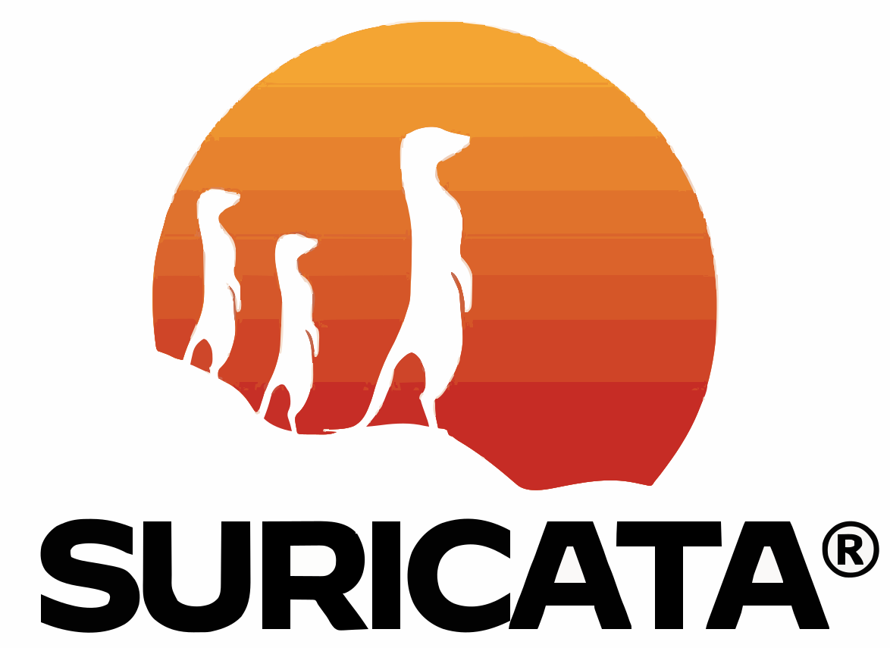

<!-- HEADER -->

  

<h1 align="center">Atharv Khunte</h1>

  <a href="mailto:atharv.khunte@gmail.com">atharv.khunte@gmail.com</a> • +91-8329564345 •
  <a href="https://www.linkedin.com/in/atharv-khunte-83b5252b2">LinkedIn</a> •
  <a href="https://github.com/AtharvKhunte">GitHub</a>

<!-- END OF HEADER -->

<!-- ABOUT ME -->
&nbsp;**ABOUT ME**

- 👨‍🎓 4th-year B.Tech — Computer Science & Business Systems (JSPM RSCOE)  
- 📱 Android developer — Java, Kotlin, Jetpack Compose, Material UI  
- 🛡️ Security & privacy enthusiast — pfSense, Suricata, Fail2Ban, Kibana  
- ⚙️ Interested in building secure, user-centric mobile apps and automation for monitoring & remediation

> [!IMPORTANT]  
> I sign commits where possible and follow secure development practices.

<!-- LINE -->

  

<!-- PROJECTS -->
&nbsp;**PROJECTS**

  
<strong>TrueLevel — Digital Bubble Level App</strong>

  <ul>
    <li>Sensor-driven leveling app with smooth real-time tilt detection, calibration, and unit toggles.</li>
    <li>Focus on a clean, responsive UI and low-latency sensor updates.</li>
    <li>Tech: Java, Android SDK, Material Design, Android Sensors API.</li>
  </ul>

  
<strong>Auth App — Secure Authentication & Profile</strong>

  <ul>
    <li>Complete authentication flow: sign-up/sign-in, validation, error handling, and profile management.</li>
    <li>Secure local storage of credentials and profile data using Android best practices.</li>
    <li>Tech: Java, Android SDK, BottomSheetDialogFragment, SharedPreferences.</li>
  </ul>

  
<strong>DataTrust SDK (Ongoing)</strong>

  <ul>
    <li>Privacy-first Android SDK to simplify secure data handling, consent management, and encryption.</li>
    <li>Modular API design for easy integration into third-party apps.</li>
    <li>Tech: Kotlin, Jetpack libraries, Android Security & Encryption APIs.</li>
  </ul>

  
<strong>Centralized Context-Aware Firewall</strong>

  <ul>
    <li>End-to-end security framework with modules for firewall, IDS, dynamic blocking, and centralized logging.</li>
    <li>Automated malicious IP blocking using parsed Suricata alerts + Fail2Ban + UFW.</li>
    <li>Log aggregation (Suricata EVE JSON, Fail2Ban, /var/log/auth.log) with Filebeat → Kibana dashboards.</li>
    <li>Edge firewall: pfSense integration for network-level enforcement and visibility.</li>
  </ul>

<!-- LINE -->

  

<!-- SKILLS -->
&nbsp; **SKILLS**

*Programming & Mobile*
&nbsp;
&nbsp;
&nbsp;
&nbsp;

*Security & Networking*
&nbsp;
&nbsp;
&nbsp;
&nbsp;

*DevOps & Tools*
&nbsp;
&nbsp;
&nbsp;

*Databases*

&nbsp;

*Other*
- Problem solving • Agile teamwork • Secure coding practices

<!-- LINE -->

  

<!-- FOOTER -->

  &nbsp;
  &nbsp;
  &nbsp;
  &nbsp;
  &nbsp;

<!-- END OF FOOTER -->
